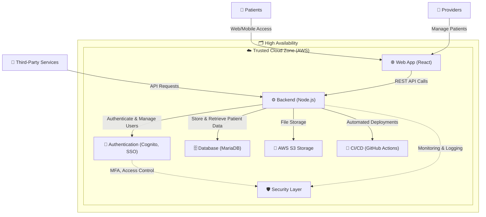

```mermaid
flowchart TD;

    %% External Users & Systems
    Patients["👤 Patients"] -->|Web/Mobile Access| Frontend["🌐 Web App (React)"]
    HealthcareProviders["🏥 Providers"] -->|Manage Patients| Frontend
    ThirdParty["🔗 Third-Party Services"] -->|API Requests| Backend["⚙️ Backend (Node.js)"]

    %% Trust Zone (Internal Cloud Environment)
    subgraph CloudZone ["☁️ Trusted Cloud Zone (AWS)"]
        Frontend -->|REST API Calls| Backend
        Backend -->|Authenticate & Manage Users| Auth["🔐 Authentication (Cognito, SSO)"]
        Backend -->|Store & Retrieve Patient Data| Database["🗄️ Database (MariaDB)"]
        Backend -->|File Storage| S3["📁 AWS S3 Storage"]

        %% Security Layer
        Auth -.->|MFA, Access Control| Security["🛡️ Security Layer"]
        Backend -.->|Monitoring & Logging| Security

        %% CI/CD
        Backend -->|Automated Deployments| CI_CD["🚀 CI/CD (GitHub Actions)"]
    end

    %% Optional Availability Zone Logic (Conceptual Layering)
    subgraph AvailabilityZones ["🗂️ High Availability"]
        CloudZone
    end
```